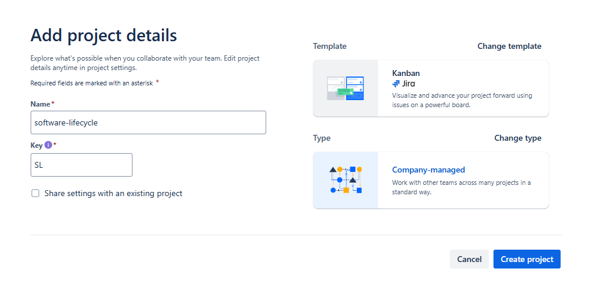
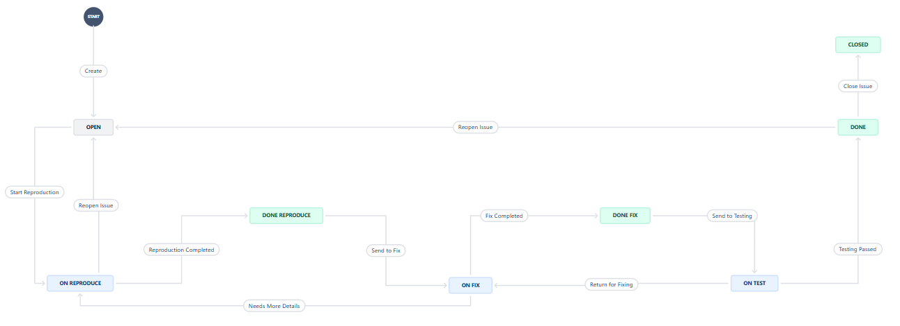
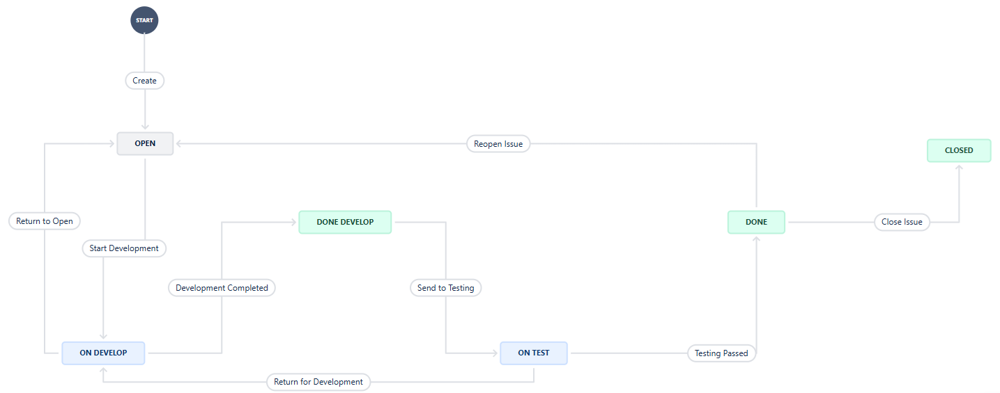

# Домашнее задание к занятию "`Жизненный цикл ПО`" - `Дедюрин Денис`

---
## Задание.

## Основная часть

Необходимо создать собственные workflow для двух типов задач: bug и остальные типы задач. Задачи типа bug должны проходить жизненный цикл:

1. Open -> On reproduce.
2. On reproduce -> Open, Done reproduce.
3. Done reproduce -> On fix.
4. On fix -> On reproduce, Done fix.
5. Done fix -> On test.
6. On test -> On fix, Done.
7. Done -> Closed, Open.

Остальные задачи должны проходить по упрощённому workflow:

1. Open -> On develop.
2. On develop -> Open, Done develop.
3. Done develop -> On test.
4. On test -> On develop, Done.
5. Done -> Closed, Open.

**Что нужно сделать**

1. Создайте задачу с типом bug, попытайтесь провести его по всему workflow до Done. 
1. Создайте задачу с типом epic, к ней привяжите несколько задач с типом task, проведите их по всему workflow до Done. 
1. При проведении обеих задач по статусам используйте kanban. 
1. Верните задачи в статус Open.
1. Перейдите в Scrum, запланируйте новый спринт, состоящий из задач эпика и одного бага, стартуйте спринт, проведите задачи до состояния Closed. Закройте спринт.
2. Если всё отработалось в рамках ожидания — выгрузите схемы workflow для импорта в XML. Файлы с workflow и скриншоты workflow приложите к решению задания.

### Ответ:

Создаем доски:

```
kanban = Projects -> Create project -> Kanban -> Use template -> Company-managed -> Create project
```



Создаем workflow **bug** и **other**:





